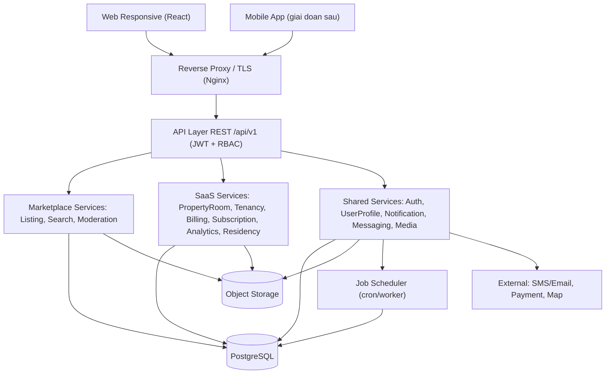
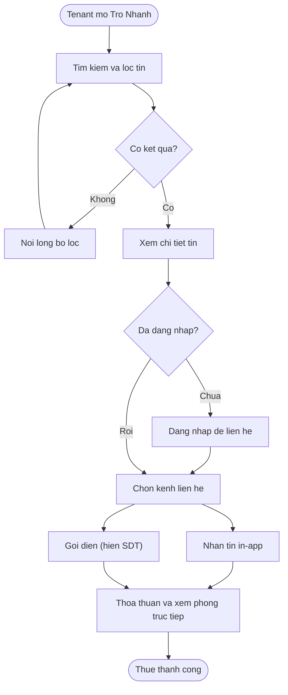
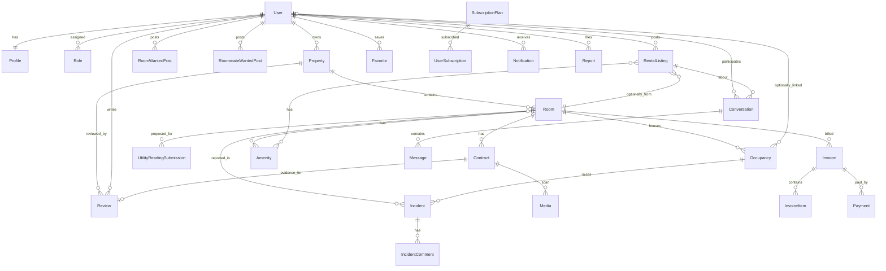
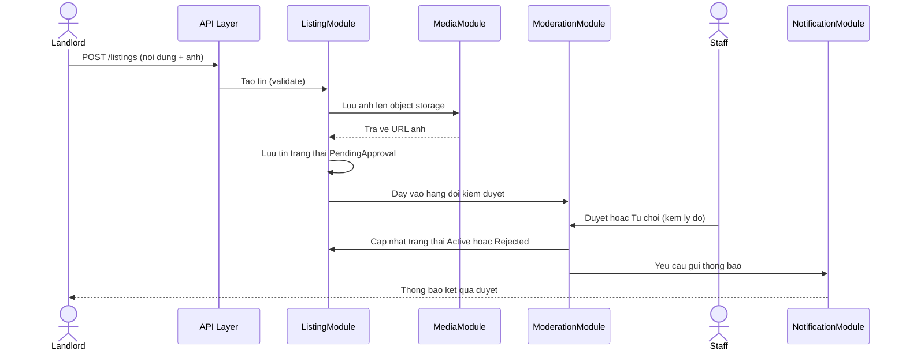
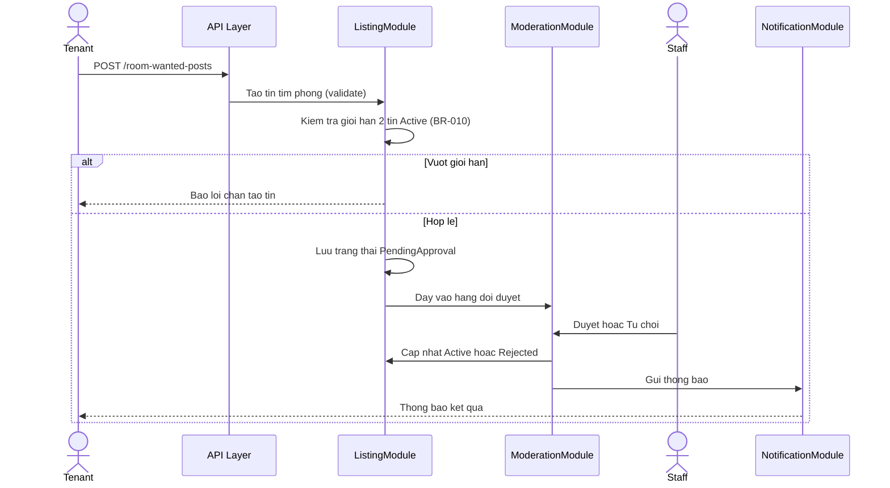
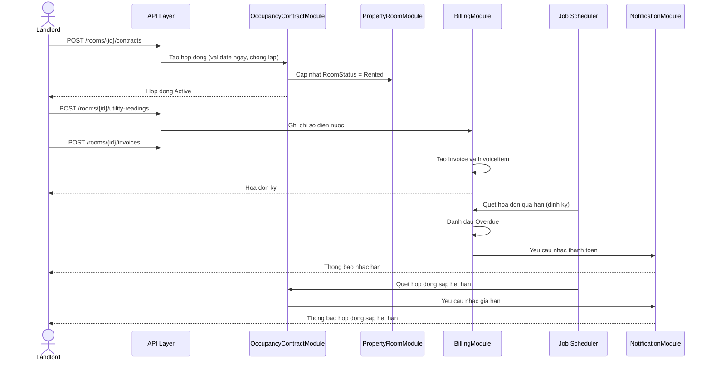
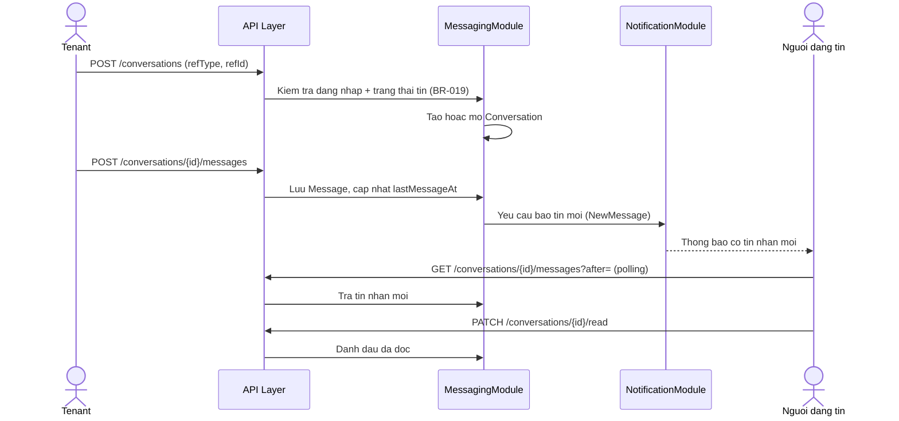
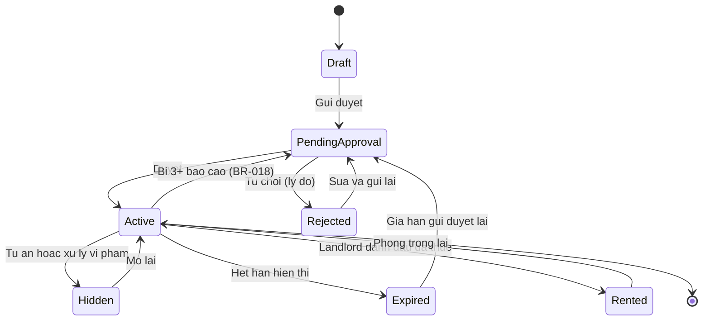

# SYSTEM DESIGN & ARCHITECTURE — TRỌ NHANH
## Tài liệu Kiến trúc Hệ thống

> Kiến trúc phục vụ đúng 20 module, các luồng nghiệp vụ và business rules đã định nghĩa ở tài liệu Đặc tả Kỹ thuật và SRS; mỗi lựa chọn kèm lý do và trade-off; tối ưu cho team nhỏ nhưng có đường scale lên production.

---

## 1. HIGH-LEVEL ARCHITECTURE

Trọ Nhanh áp dụng kiến trúc **Modular Monolith phân lớp (layered)**: một codebase backend duy nhất nhưng chia thành **2 bounded context** (`Marketplace` và `Property Management / SaaS`) cùng một **Shared Kernel**, tổ chức theo các module (Mục 4), mỗi module có ranh giới trách nhiệm và giao tiếp qua interface nội bộ. Hai domain **không gọi chéo trực tiếp** vào table của nhau — chỉ cùng gọi xuống Shared Kernel — để giữ ranh giới sạch, sẵn sàng tách service về sau.

Các layer chính:
- **Client Layer:** Web (Next.js) với **3 shell** — *Public/Tenant* (Marketplace), *Management Workspace* (`/chu-tro/*`) và *Residency* (`/nguoi-o/*`) — cùng **app mobile Expo cho người ở**. Chung component library và API client, cho các nhóm Dev làm song song.
- **API Layer:** REST API có versioning, là cổng vào duy nhất của hệ thống.
- **Application Layer:** các module chia theo 2 domain (Marketplace, SaaS) + Shared Kernel; module `Residency` nằm trong domain SaaS.
- **Data Layer:** cơ sở dữ liệu quan hệ + object storage cho file.
- **External Integrations:** SMS/Email gateway, Map service, Payment gateway.

**Lý do chọn Modular Monolith cho MVP:**
- Team nhỏ (5 người, phần lớn là sinh viên): một codebase dễ phát triển, debug, deploy; không tốn chi phí vận hành nhiều service.
- Giao dịch dữ liệu giữa các module (vd: tạo Contract → đổi RoomStatus → sinh Notification) nằm trong cùng một database, dùng transaction đơn giản, tránh phức tạp của distributed transaction.
- Vẫn giữ ranh giới module rõ để **sẵn sàng tách microservices** khi tải tăng (các service nặng như Search, Notification, Messaging, Billing tách trước).

**Trade-off so với Microservices:**

| Tiêu chí | Modular Monolith (chọn) | Microservices |
|---|---|---|
| Độ phức tạp vận hành | Thấp — 1 service, 1 pipeline | Cao — nhiều service, service mesh, observability |
| Tốc độ phát triển ban đầu | Nhanh, hợp team nhỏ | Chậm, tốn hạ tầng |
| Chi phí hạ tầng | Thấp (hợp dự án môn học) | Cao |
| Khả năng scale từng phần | Hạn chế (scale cả khối) | Tốt (scale riêng service) |
| Rủi ro coupling | Cần kỷ luật module hóa | Tách bằng ranh giới mạng |

Kết luận: với quy mô và mục tiêu hiện tại, Modular Monolith là lựa chọn cân bằng nhất; ranh giới module được thiết kế sao cho việc tách service sau này ít tốn công.

---

## 2. CLIENT LAYER: WEB / MOBILE

**Web (Next.js) là mặt chính; app mobile phục vụ riêng người ở.**

| Shell | Route gốc | Người dùng | Ghi chú |
|---|---|---|---|
| Public/Tenant | `/` | Guest, Tenant | Trang tin đăng cần **SSR** để Google index |
| Management Workspace | `/chu-tro/*` | Landlord | Chia 2 zone: Tin đăng (miễn phí) và SaaS (gating) |
| Residency | `/nguoi-o/*` | Tenant có `residencyStatus ∈ {ACTIVE, PAST}` | Dùng chung API với app mobile |

**App mobile (Expo React Native)** dành cho người ở: xem phòng, hóa đơn, báo sự cố, gửi chỉ số điện nước kèm ảnh, nhận push. Chủ trọ dùng web vì Workspace là dashboard nhiều bảng biểu, hợp màn hình lớn.

**Trade-off lựa chọn Next.js + Expo:**

| Phương án | Ưu | Nhược |
|---|---|---|
| Next.js + Expo (chọn) | Cùng React/TypeScript: dùng chung type, API client, Zod schema và tư duy file-based routing; SSR cho SEO tin đăng | Cần Node runtime cho SSR |
| Angular + Flutter | Học được nhiều paradigm hơn | Nuôi hai hệ sinh thái tách rời, không chia sẻ được gì, chậm ra sản phẩm |
| Chỉ web responsive, không app | Rẻ nhất | Mất trải nghiệm push và chụp ảnh trực tiếp cho người ở |

**Nguyên tắc bất biến:** app người ở là **lớp cộng thêm, không phải điều kiện tiên quyết** — mọi nghiệp vụ của chủ trọ chạy trọn vẹn ngay cả khi không người ở nào có tài khoản (Occupancy fallback `userId` null).

Client chỉ giao tiếp với backend qua REST API, không truy cập DB trực tiếp. Vì backend và client cùng là TypeScript trong một monorepo, **định nghĩa dữ liệu dùng chung trực tiếp** qua `packages/schemas` — không còn bước sinh mã trung gian nào.

---

## 3. API LAYER

- **Phong cách:** REST API, dữ liệu JSON, đặt dưới prefix versioned `/api/v1` để về sau nâng cấp không phá vỡ client cũ.
- **Xác thực:** Bearer token (JWT) trong header `Authorization`.
- **API Gateway:** giai đoạn MVP **chưa cần API gateway riêng**; một reverse proxy (vd Nginx) phía trước backend đảm nhiệm TLS termination, định tuyến, rate limiting cơ bản. Khi tách microservices mới cân nhắc API gateway thực thụ.

**Trade-off API Gateway:**

| Phương án | Ưu | Nhược |
|---|---|---|
| Reverse proxy + monolith (chọn cho MVP) | Đơn giản, đủ dùng, rẻ | Thiếu tính năng nâng cao (aggregation, per-service auth) |
| API Gateway đầy đủ (Kong/APISIX) | Quản trị tập trung, hợp microservices | Thừa và phức tạp cho MVP một service |

**Namespace tách theo domain** để middleware mount theo tiền tố, không chặn nhầm route của domain khác:

| Tiền tố | Thuộc về | Middleware |
|---|---|---|
| `/auth/*`, `/me/*`, `/notifications/*`, `/conversations/*`, `/media/*` | Shared Kernel | auth (trừ `/auth/*`) |
| `/public/*` | Marketplace công khai | không |
| `/marketplace/*` | Marketplace cần đăng nhập | auth |
| `/management/*` | SaaS chủ trọ | auth + role Landlord + gating |
| `/residency/*` | Người ở | auth + residency guard |
| `/admin/*` | Admin/Staff | auth + role nội bộ |

Chi tiết convention REST, response/error format, pagination ở Mục 18.

---

## 4. BACKEND SERVICES

Các module (khớp Mục 11 tài liệu Đặc tả Kỹ thuật) chia theo 2 domain + Shared Kernel:

### 4.1 Marketplace services
| Service | Trách nhiệm | Module |
|---|---|---|
| ListingModule | CRUD tin cho thuê + tin nhu cầu thuê, vòng đời (BR-001, BR-003, BR-009, BR-010), boost (BR-005); lưu **giờ giấc ra vào** và timestamp đăng/cập nhật của tin | 3,4 |
| SearchModule | Tìm kiếm/lọc/sắp xếp/phân trang tin Active; lọc theo giờ giấc & điểm đánh giá; gợi ý phòng theo RoomWantedPost | 12 |
| ReviewModule | Đánh giá khu trọ **verified-only** (BR-022): xác minh Contract, tính `avgRating` của Property, phục vụ badge & trang khu public | 19 |
| ModerationModule | Hàng đợi duyệt, lọc từ khóa, xử lý Report tin + tin nhắn + **đánh giá** (BR-018, BR-020, BR-023), audit log | 13,14 |

### 4.2 SaaS management services
| Service | Trách nhiệm | Module |
|---|---|---|
| PropertyRoomModule | Property (+ thông tin nhận tiền của khu, cờ hồ sơ khu public), Room (+ giờ giấc), trạng thái phòng (BR-002, BR-011), tạo listing từ room | 5,6 |
| OccupancyContractModule | Occupancy (gắn tài khoản/fallback), Contract (BR-006, bằng chứng cho review), upload/truy cập scan (BR-008) | 7,8 |
| BillingModule | Chủ trọ nhập UtilityReading (người ở gửi chỉ số qua kênh ngoài), Invoice/InvoiceItem (BR-004), xuất hóa đơn kèm QR/STK, ghi nhận Payment (Cash/BankTransfer); job Overdue | 9 |
| SubscriptionModule | SubscriptionPlan, UserSubscription, **gating 4 trạng thái NONE/TRIAL/ACTIVE/READ_ONLY** và hạn mức (BR-013, BR-015), thu phí nền tảng | 15 |
| AnalyticsModule | KPI dashboard Landlord (BR-012) & Admin; ghi nhận contactEvent | 16 |

### 4.3 Shared services
| Service | Trách nhiệm | Module |
|---|---|---|
| AuthModule | Đăng ký/đăng nhập, OTP, token, role; middleware RBAC | 1 |
| UserProfileModule | Profile, display settings (BR-012) | 2 |
| NotificationModule | Notification in-app + SMS/email; báo tin nhắn mới; scheduled jobs nhắc hạn (BR-017) | 10 |
| MessagingModule | Conversation/Message (BR-019), chặn/đánh dấu đã đọc; phối hợp ModerationModule khi báo cáo và NotificationModule khi có tin mới | 17 |
| MediaModule | Upload/validate file, object storage, signed URL; phân biệt public/private | xuyên suốt |

Các service giao tiếp qua lời gọi nội bộ (in-process) trong monolith; ranh giới được giữ để có thể chuyển sang gọi qua mạng khi tách service.

**Cơ chế realtime cho Messaging (polling trước, WebSocket sau):** giai đoạn này client cập nhật tin nhắn mới bằng **HTTP polling** (gọi `GET /conversations/{id}/messages?after=` theo chu kỳ ngắn). Đây là quyết định kỹ thuật **sẽ chốt cụ thể tại buổi họp team Dev**.

| Phương án | Ưu | Nhược |
|---|---|---|
| HTTP polling (chọn cho giai đoạn này) | Đơn giản, không thêm hạ tầng, hợp monolith + REST, đủ cho lượng người dùng đầu | Độ trễ và tải tăng khi số hội thoại lớn (gọi lặp) |
| WebSocket / SSE (nâng cấp sau) | Realtime thực sự, ít tải lặp | Cần kết nối lâu dài, thêm hạ tầng (sticky session/pub-sub), phức tạp khi scale ngang |

Định hướng nâng cấp: khi tải chat tăng, đưa MessagingModule sang kênh realtime (WebSocket/SSE) qua pub-sub (vd Redis), tách thành service riêng.

---

## 5. DATABASE LAYER

**Lựa chọn: cơ sở dữ liệu quan hệ (RDBMS) — đề xuất PostgreSQL.**

**Lý do:**
- Dữ liệu Trọ Nhanh có quan hệ chặt và nhiều ràng buộc toàn vẹn (Property–Room–Contract–Invoice–Payment), rất hợp mô hình quan hệ và transaction ACID.
- Nhiều business rule cần nhất quán mạnh (vd BR-006: mỗi Room tối đa 1 Contract Active; BR-011: ràng buộc xóa Property) — RDBMS đảm bảo bằng constraint/transaction.
- PostgreSQL hỗ trợ `jsonb` cho field linh hoạt (displaySettings, desiredDistricts), full-text search cơ bản, và index đa dạng phục vụ Search.

**Tổ chức dữ liệu Marketplace vs SaaS (cùng một database, tách theo nhóm bảng):**
- **Nhóm Marketplace:** RentalListing, RoomWantedPost, RoommateWantedPost, Favorite, Report, Review, Amenity, Media, BannedKeyword, ContactEvent.
- **Nhóm SaaS:** Property, Room, Occupancy, Contract, Invoice, InvoiceItem, UtilityReading, Payment, SubscriptionPlan, UserSubscription.
- **Nhóm Shared:** User, Role, Profile, Notification, Conversation, Message.
- Cô lập dữ liệu SaaS giữa các Landlord bằng cột `ownerId`/`landlordId` trên mọi bảng SaaS, ràng buộc ở tầng query (Mục 10).

**Trade-off RDBMS vs NoSQL:**

| Phương án | Ưu | Nhược |
|---|---|---|
| PostgreSQL (chọn) | Toàn vẹn dữ liệu, transaction, quan hệ rõ, jsonb linh hoạt | Cần thiết kế schema chặt từ đầu |
| MongoDB (NoSQL) | Linh hoạt schema, scale ngang dễ | Yếu về ràng buộc quan hệ/transaction đa bảng — rủi ro với dữ liệu tài chính |

Ghi chú: bảng `Message` có thể tăng nhanh; đánh index theo (conversationId, createdAt) và cân nhắc phân vùng (partition) theo thời gian khi dữ liệu lớn.

---

## 6. FILE / MEDIA STORAGE

- **Lưu trên object storage** (vd AWS S3 / MinIO self-host / Cloudinary), **không lưu file nhị phân trong DB**; DB chỉ lưu URL và metadata (entity Media).
- **Hai loại media phân biệt bằng cờ `isPrivate`:**
  - **Public:** ảnh tin đăng, ảnh phòng — đọc công khai qua CDN.
  - **Private:** bản chụp hợp đồng, ảnh sự cố và ảnh chỉ số đồng hồ — lưu private bucket, chỉ truy cập qua **signed URL hết hạn ≤ 15 phút** (NFR-015, BR-008), phân quyền owner + Tenant liên kết.

**Lý do tách object storage:**
- Giảm tải DB, rẻ, scale tốt cho file lớn; CDN tăng tốc tải ảnh.
- Đáp ứng yêu cầu bảo mật file hợp đồng theo Luật 91/2025 (private + signed URL + cho xóa).

**Trade-off:** lưu file trong DB đơn giản hơn lúc đầu nhưng phình DB, backup nặng, khó scale — không chọn.

---

## 7. AUTHENTICATION & AUTHORIZATION

**Mô hình 3 tầng độc lập** — không trộn lẫn:

| Tầng | Lưu ở đâu | Trả lời | Giá trị |
|---|---|---|---|
| Trạng thái tài khoản `User.status` | DB | Có dùng được hệ thống không? | `PendingVerification` / `Active` / `Locked` |
| Role `roles[]` | Claims trong JWT | Được vào shell/nhóm endpoint nào? | `Tenant` / `Landlord` / `Admin` / `Staff` |
| Trạng thái năng lực | Suy từ DB mỗi request | Trong shell đó làm được gì? | `subscriptionStatus`: NONE/TRIAL/ACTIVE/READ_ONLY · `residencyStatus`: NONE/PENDING/ACTIVE/PAST |

**Role cộng dồn:** mọi tài khoản là `Tenant`; đăng tin hoặc mở Workspace lần đầu thì tự thêm `Landlord` — không bắt chọn vai trò lúc đăng ký. Sau khi thêm role phải cấp lại token vì claims cũ đã đóng băng.

**Không nhét trạng thái năng lực vào JWT:** chúng đổi theo thời gian trong khi claims giữ nguyên tới lúc token hết hạn — nhét vào sẽ có khoảng thời gian hệ thống mở/khóa sai. Gating là quyết định tiền bạc nên phải luôn tươi; roles gần như bất biến nên để trong token cho stateless.

**Không có role "Resident":** người ở vẫn là Tenant, chỉ khác ở chỗ có một `Occupancy` đã xác nhận. Điều kiện vào Residency shell là *dữ liệu* (`residencyStatus`), giống hệt cách Workspace dùng `subscriptionStatus`. Ba tầng trực giao — một chủ trọ đang đi thuê nhà nơi khác có thể đồng thời có cả `subscriptionStatus=ACTIVE` và `residencyStatus=ACTIVE`.

**`GET /me` là nguồn chân lý phía client**, trả `{ user, profile, roles[], subscriptionStatus, residencyStatus }`; web và app mobile gọi sau đăng nhập/refresh để render điều hướng.

**Pipeline kiểm tra:**
- Endpoint SaaS: token hợp lệ → role Landlord → ownership `landlordId` (BR-007) → gating `subscriptionStatus`.
- Endpoint Residency: token hợp lệ → `residencyStatus` → bản ghi truy cập phải thuộc một người ở đã liên kết với chính tài khoản đó (BR-034).


- **Cơ chế:** JWT **access token** (ngắn hạn, ~15–30 phút) + **refresh token** (dài hạn, lưu an toàn) — stateless, hợp kiến trúc scale ngang.
- **Đăng ký/đăng nhập:** qua số điện thoại + OTP (BR-016); mật khẩu băm bằng bcrypt/argon2 (NFR-011).
- **RBAC:** middleware kiểm tra role (Guest/Tenant/Landlord/Admin/Staff) và **ownership** trên mỗi request; áp đúng ma trận quyền ở tài liệu Đặc tả Kỹ thuật. Riêng Messaging kiểm tra người gọi là một trong hai người tham gia Conversation.
- **Bảo vệ liên hệ:** Guest chỉ thấy SĐT che một phần, đăng nhập mới xem đầy đủ; nhắn tin in-app không lộ SĐT (BR-014).

**Trade-off JWT (stateless) vs Session (stateful):**

| Phương án | Ưu | Nhược |
|---|---|---|
| JWT + refresh (chọn) | Stateless, dễ scale ngang, hợp REST | Thu hồi token tức thời khó hơn (giải quyết bằng refresh ngắn hạn + blacklist khi cần) |
| Server session | Thu hồi dễ | Cần lưu session tập trung (sticky/Redis), khó scale hơn |

---

## 8. NOTIFICATION SERVICE

NotificationModule phục vụ Module 10, gồm hai kênh:
- **In-app notification:** lưu entity Notification, hiển thị trong app, đánh dấu đã đọc; bao gồm loại **NewMessage** (báo có tin nhắn mới — phối hợp với MessagingModule).
- **External:** SMS/Email qua gateway cho OTP và các nhắc hạn quan trọng; (push notification để dành cho mobile app giai đoạn sau).

**Cơ chế nhắc hạn định kỳ (scheduled job/cron):**
- Một **job scheduler** chạy định kỳ (vd mỗi ngày) quét và sinh thông báo:
  - Nhắc Contract sắp hết hạn (trước endDate 30 ngày) — BR-006/FR-042.
  - Đánh dấu Invoice Overdue khi qua dueDate và bắn thông báo — BR-004/FR-046.
  - Nhắc gia hạn gói SaaS trước **6 / 2 / 1 tháng** — BR-017/FR-049.
  - Chuyển tin Expired khi hết hạn hiển thị — BR-009.

**Lý do dùng scheduled job:** các tác vụ này theo thời gian, không do người dùng kích hoạt; tách job scheduler khỏi luồng request giúp API nhẹ và dễ scale. Giai đoạn MVP dùng cron nội bộ; khi scale có thể chuyển sang message queue + worker.

---

## 9. SEARCH / FILTER MECHANISM

**Giai đoạn MVP: dùng truy vấn database + index, chưa dùng search engine riêng.**

- Tìm theo từ khóa/khu vực + lọc (giá, loại hình [phòng trọ/căn hộ dịch vụ/căn hộ chung cư], diện tích, tiện ích) + sắp xếp (boost trước theo BR-005, rồi approvedAt) + phân trang.
- **Index đề xuất:** RentalListing(status, provinceCode, wardCode, price, typeId, approvedAt, boostExpireAt); hỗ trợ full-text search cơ bản của PostgreSQL cho title/description.

**Trade-off DB query vs Elasticsearch:**

| Phương án | Ưu | Nhược |
|---|---|---|
| DB query + index (chọn cho MVP) | Đơn giản, không thêm hạ tầng, đủ nhanh với quy mô đầu (NFR-018) | Hạn chế khi cần full-text nâng cao, gợi ý, geo-search quy mô lớn |
| Elasticsearch (về sau) | Full-text mạnh, facet, gợi ý, geo tốt | Thêm hạ tầng, cần đồng bộ dữ liệu, tốn vận hành |

Đường nâng cấp: khi lượng tin và truy vấn tăng, đưa RentalListing sang Elasticsearch, đồng bộ qua event từ ListingModule.

---

## 10. SAAS MANAGEMENT MODULE (MULTI-TENANCY)

**Mô hình: multi-tenant mức dữ liệu (shared database, shared schema), cô lập theo `landlordId`/`ownerId`.**

- Mọi bảng SaaS (Property, Room, Occupancy, Contract, Invoice, UtilityReading, Payment, UserSubscription) mang cột chủ sở hữu.
- **Cô lập dữ liệu giữa các Landlord:** tầng service luôn chèn điều kiện `WHERE ownerId = currentUser` vào mọi truy vấn SaaS; không endpoint nào trả dữ liệu Landlord khác (BR-007). Cân nhắc Row-Level Security của PostgreSQL để chặn ở tầng DB như lớp phòng vệ thứ hai.
- **Subscription & feature gating:** SubscriptionModule quản lý **4 trạng thái Workspace** `NONE → TRIAL → ACTIVE → READ_ONLY` (BR-013, BR-015). TRIAL cho dùng thử có thời hạn (mặc định 1 tháng, cấu hình qua `SubscriptionPlan.trialDays`) với giới hạn nhẹ; ACTIVE đầy đủ theo `maxProperties/maxRooms`; hết hạn TRIAL/gói → **READ_ONLY**: khóa thao tác *ghi* của các module quản lý vận hành, **dữ liệu giữ nguyên**; Marketplace và Messaging không bị ảnh hưởng. Việc tạo Property/Room nằm sau cổng gating này; đăng tin trên Marketplace thì miễn phí, không gating.

**Workspace shell chia 2 zone** để chủ trọ luôn thấy rõ cái gì miễn phí, cái gì thuộc gói: zone *Tin đăng* (quản lý tin, đăng tin — không gating) và zone *Quản lý vận hành* (Property/Room/hóa đơn — có gating). Đây vừa là minh bạch, vừa là điểm chạm upsell tự nhiên.

**Trade-off mô hình multi-tenant:**

| Mô hình | Ưu | Nhược |
|---|---|---|
| Shared DB + shared schema, lọc theo ownerId (chọn) | Đơn giản, rẻ, dễ vận hành cho team nhỏ | Phải kỷ luật lọc owner ở mọi query; rủi ro rò rỉ nếu sót |
| Schema/Database riêng mỗi tenant | Cô lập mạnh | Phức tạp vận hành, không hợp số lượng Landlord lớn và team nhỏ |

---

## 11. ADMIN MODULE

- **Phạm vi:** quản lý user (khóa/mở, gán role), hàng đợi kiểm duyệt 3 loại tin, **kiểm duyệt đánh giá bị báo cáo**, quản lý danh mục (loại hình cho thuê, tiện ích, khu vực, khoảng giá, gói dịch vụ kèm thời gian dùng thử, gói đẩy tin), xử lý Report/khiếu nại (tin + tin nhắn + đánh giá), dashboard hệ thống.
- **Phân tách quyền:** Admin toàn quyền; Staff là **tập con** chỉ gồm kiểm duyệt tin và xử lý báo cáo (đúng ma trận RBAC ở tài liệu Đặc tả Kỹ thuật).
- **Audit:** mọi hành động duyệt/từ chối/khóa/truy cập dữ liệu nhạy cảm ghi audit log kèm actor + lý do + thời điểm (NFR-026).
- Admin Module dùng chung ModerationModule và AuthModule, không phải service tách riêng — giảm trùng lặp.

---

## 12. DEPLOYMENT ARCHITECTURE

> Một monorepo nhưng **triển khai tách rời từng ứng dụng**: `apps/web` (Next.js, cần Node runtime cho SSR), `apps/api` (NestJS, cần Node runtime), `apps/mobile` phát hành qua EAS Build. Mỗi ứng dụng một pipeline riêng, chỉ rõ thư mục gốc và lệnh build vì nền tảng triển khai mặc định nghĩ repo chỉ có một ứng dụng.

**Ba môi trường:** Development (máy dev/local), Staging (kiểm thử nội bộ giống production), Production (người dùng thật).

**Container hóa bằng Docker:**
- Mỗi thành phần (backend, frontend, database, reverse proxy) chạy trong container; `docker-compose` cho dev/staging giúp dựng môi trường đồng nhất chỉ bằng một lệnh.
- Lý do: tránh "chạy được trên máy tôi", dễ onboard thành viên mới, dễ chuyển hosting.

**Gợi ý hosting chi phí thấp (hợp dự án môn học):**
- Backend + DB: một VPS giá rẻ (DigitalOcean/Vultr/AWS Lightsail) chạy Docker; hoặc nền tảng PaaS miễn phí/giá thấp (Render, Railway, Fly.io) cho giai đoạn demo.
- Object storage: MinIO self-host trên cùng VPS để tiết kiệm, hoặc Cloudinary/S3 free tier.
- Frontend: hosting tĩnh/Edge (Vercel/Netlify) nếu tách SPA.

```
[Internet] -> [Reverse Proxy / TLS (Nginx)] -> [Backend container (Modular Monolith)]
                                                   |-> [PostgreSQL container]
                                                   |-> [Object Storage (MinIO/S3)]
                                                   |-> [Job Scheduler (cron/worker)]
External: SMS/Email gateway, Payment gateway, Map service
```

**Trade-off VPS + Docker vs PaaS:** VPS rẻ và kiểm soát cao nhưng tự lo vận hành; PaaS nhanh, ít vận hành nhưng đắt dần khi scale. Khuyến nghị: PaaS cho giai đoạn demo, chuyển VPS/cloud khi cần kiểm soát chi phí và hiệu năng.

---

## 13. SECURITY ARCHITECTURE

| Lớp | Biện pháp |
|---|---|
| Truyền tải | HTTPS/TLS toàn bộ; HSTS (NFR-017) |
| Mật khẩu | Băm bcrypt/argon2, không lưu plaintext (NFR-011) |
| Xác thực/Phân quyền | JWT + refresh token; RBAC kiểm tra role + ownership mọi request (NFR-012) |
| Input validation | Validate phía server theo tài liệu Đặc tả Kỹ thuật (giá, diện tích, SĐT, ảnh, ngày, nội dung tin nhắn...) chống dữ liệu bẩn và injection |
| Rate limiting | Giới hạn tần suất ở reverse proxy + theo user/IP cho các endpoint nhạy cảm (login, OTP, đăng tin, gửi tin nhắn) — chống brute force và spam (NFR-014) |
| Bảo vệ liên hệ | SĐT che một phần với Guest; nhắn tin in-app không lộ SĐT (BR-014); chống bóc tách dữ liệu hàng loạt |
| An toàn nhắn tin | Chỉ người tham gia đọc/gửi trong Conversation; hỗ trợ chặn & báo cáo (BR-019, BR-020); lọc spam/từ khóa cấm cho Message |
| Dữ liệu cá nhân người ở | Occupancy/Contract là dữ liệu riêng tư Landlord (BR-007); scan hợp đồng private + signed URL (BR-008); tuân thủ Luật 91/2025 (NFR-016) |
| Chống spam tin | Lọc từ khóa, giới hạn tin Active (BR-010), tự rà tin bị báo cáo (BR-018) |
| Audit | Ghi log hành động nhạy cảm (NFR-026) |

---

## 14. DATA FLOW (mô tả bằng lời)

**Luồng tìm kiếm – liên hệ (Tenant):** Client gửi request tìm kiếm kèm bộ lọc → API Layer xác thực (nếu cần) → SearchModule truy vấn RentalListing (chỉ Active, boost trước) → trả danh sách phân trang → Tenant mở chi tiết → ListingModule trả thông tin tin → khi Tenant bấm "Nhắn tin" mở hội thoại in-app (MessagingModule, không lộ SĐT) hoặc bấm "Gọi" để xem SĐT đầy đủ; AnalyticsModule ghi contactEvent.

**Luồng nhắn tin (Messaging):** Tenant/Landlord mở hội thoại từ một tin → MessagingModule kiểm tra đăng nhập và trạng thái tin (BR-019), tạo/mở Conversation → gửi Message → lưu DB, cập nhật lastMessageAt → NotificationModule bắn thông báo NewMessage cho người nhận → client người nhận cập nhật tin mới qua polling, đánh dấu đã đọc. Báo cáo/chặn đi qua ModerationModule (BR-020).

**Luồng đăng tin – kiểm duyệt (Landlord):** Landlord gửi tin → ListingModule validate và lưu (PendingApproval) → MediaModule lưu ảnh lên object storage → tin vào hàng đợi ModerationModule → Staff duyệt → tin Active, NotificationModule báo Landlord → SearchModule phục vụ tin trong kết quả.

**Luồng quản lý vận hành (Landlord, SaaS):** Landlord tạo Property/Room (PropertyRoomModule) → thêm Occupancy (gắn tài khoản Tenant nếu có, hoặc fallback tên+SĐT) và tạo Contract (OccupancyContractModule), Room chuyển Rented → hằng kỳ ghi UtilityReading và tạo Invoice (BillingModule) → **xuất hóa đơn kèm STK + QR của khu** để người ở chuyển khoản thẳng cho chủ trọ hoặc trả tiền mặt → chủ trọ bấm "Đã thu" ghi Payment (Cash/BankTransfer) → job đánh dấu Overdue và NotificationModule nhắc hạn → AnalyticsModule tổng hợp KPI. Nền tảng KHÔNG cầm tiền (AS-002).

**Luồng đánh giá khu trọ (verified):** Tenant đã/đang có Contract ở Property mở "Phòng của tôi" → viết đánh giá (sao + nội dung) → ReviewModule xác minh `contractId` thuộc người viết (BR-022), chặn trùng theo đợt ở (BR-023) → lưu Review, cập nhật `avgRating` của Property → hiển thị ở badge trên tin đăng của khu và trang khu public (`/khu-tro/{slug}`). Người ở fallback (không tài khoản) không đánh giá được.

**Luồng Residency (người ở):** Tenant có `Occupancy` đã xác nhận mở Residency shell hoặc app mobile → ResidencyModule trả về phòng đang ở, hợp đồng, hóa đơn của chính mình (lọc theo `Occupancy.userId`, BR-034). Người ở **chỉ xem** dữ liệu vận hành, không nhập điện nước chính thức.

**Luồng báo sự cố:** người ở tạo `Incident` kèm ảnh → Notification cho Landlord sở hữu khu → chủ trọ xử lý trong Workspace theo vòng đời `Open → Acknowledged → InProgress → Resolved → Closed`, trao đổi qua `IncidentComment`, mỗi lần đổi trạng thái sinh Notification cho phía còn lại (BR-035).

**Luồng đề xuất chỉ số điện nước:** nếu khu bật `allowOccupantMeterSubmission`, người ở gửi số kèm **ảnh đồng hồ** → `UtilityReadingSubmission` trạng thái `Pending` → chủ trọ xem ảnh rồi xác nhận/sửa/từ chối; **chỉ khi xác nhận mới sinh `UtilityReading` chính thức** và luồng hóa đơn chạy tiếp (BR-033).

**Luồng thanh toán phí nền tảng:** client tạo `PlatformTransaction` → chuyển sang gateway → **webhook server-to-server** là nơi *duy nhất* kích hoạt quyền lợi (boost/gói), chống trùng bằng `idempotencyKey` vì trình duyệt người dùng có thể đóng tab giữa chừng.

**Luồng thu phí nền tảng:** Landlord mua boost hoặc gói SaaS → SubscriptionModule/ListingModule gọi Payment gateway → xác nhận thanh toán → kích hoạt boost hoặc gia hạn UserSubscription. Lưu ý: nền tảng không xử lý tiền thuê Tenant–Landlord (AS-002).

---

## 15. MODULE INTERACTION

Quan hệ gọi chính giữa các service:

- **AuthModule** được mọi service dựa vào để xác thực/RBAC (middleware).
- **ListingModule** gọi **MediaModule** (lưu ảnh), **ModerationModule** (đẩy duyệt), **NotificationModule** (báo kết quả); đọc Profile để prefill liên hệ.
- **MessagingModule** đọc tin (refType/refId) và người tham gia; gọi **NotificationModule** (báo tin mới) và **ModerationModule** (chặn/báo cáo).
- **PropertyRoomModule** gọi **SubscriptionModule** (kiểm hạn mức/feature gating) khi tạo Property/Room; phối hợp **ListingModule** khi "Tạo tin từ phòng".
- **OccupancyContractModule** cập nhật RoomStatus qua **PropertyRoomModule**; gọi **MediaModule** (scan hợp đồng); gọi **NotificationModule** (nhắc hết hạn).
- **BillingModule** đọc Contract/Room từ **OccupancyContractModule/PropertyRoomModule**; xuất hóa đơn kèm thông tin nhận tiền của Property; gọi **NotificationModule** (nhắc/Overdue); cung cấp dữ liệu doanh thu cho **AnalyticsModule**.
- **SubscriptionModule** gọi **Payment gateway**; cung cấp trạng thái gói cho các SaaS service (gating).
- **AnalyticsModule** đọc dữ liệu tổng hợp từ Room/Contract/Invoice/Payment; nhận contactEvent từ luồng liên hệ.
- **ModerationModule** cập nhật trạng thái tin của **ListingModule** và hội thoại của **MessagingModule**; xử lý Report (tin/tin nhắn/đánh giá); ghi audit.
- **ReviewModule** đọc Contract từ **OccupancyContractModule** để xác minh quyền đánh giá; cập nhật `avgRating` của Property qua **PropertyRoomModule**; cung cấp badge/điểm cho **SearchModule** và trang khu public.
- **NotificationModule** được nhiều service gọi và chạy scheduled jobs độc lập.

Nguyên tắc: phụ thuộc một chiều theo nhóm (Marketplace/SaaS gọi xuống Shared), tránh vòng lặp phụ thuộc để dễ tách service sau này.

---

## 16. TECH STACK (đã chốt)

**Một monorepo `tro-nhanh`** chứa cả ba ứng dụng: `apps/web` (Next.js), `apps/mobile` (Expo) và `apps/api` (NestJS), cùng các package dùng chung trong `packages/`.

| Layer | Công nghệ | Lý do |
|---|---|---|
| Backend | **NestJS · TypeScript · Node 22 LTS** | Cùng ngôn ngữ với web và mobile nên dùng chung được định nghĩa dữ liệu; cấu trúc module ánh xạ thẳng sang hai domain nghiệp vụ |
| Truy cập dữ liệu | **Prisma** | Tự sinh kiểu từ schema; migration có đánh số là nguồn chân lý của cấu trúc dữ liệu |
| Web (3 shell) | **Next.js (App Router)** | SSR cho trang tin đăng để Google index — SEO là kênh thu hút người thuê |
| Mobile (người ở) | **Expo React Native** | Cùng React/TypeScript với web: chung type, API client, tư duy routing |
| Tổ chức mã client | **Monorepo pnpm** | `apps/web`, `apps/mobile` + `packages/types`, `api-client`, `tailwind-preset` |
| Styling | **Tailwind v3 + NativeWind** | Chung một preset thiết kế cho web và mobile. Bản NativeWind ổn định yêu cầu Tailwind v3 |
| Định nghĩa dữ liệu dùng chung | **Zod schema** trong `packages/schemas` | Backend dùng để kiểm tra đầu vào, web và mobile dùng cho biểu mẫu; kiểu suy ra từ chính schema, không cần bước sinh mã trung gian |
| Biểu mẫu và kiểm tra dữ liệu | **react-hook-form + Zod** | Dùng chung schema với backend |
| Data fetching | **TanStack Query** | Cache, retry, invalidation sẵn có |
| API | REST (JSON) | Đơn giản, phổ biến, đủ cho quy mô dự án |
| Realtime chat | HTTP polling → WebSocket/SSE sau | Bắt đầu nhẹ, nâng cấp khi tải chat tăng |
| Database | PostgreSQL | Quan hệ chặt, transaction, jsonb, full-text cơ bản |
| Object storage | MinIO (self-host) / S3 | Tách file khỏi DB, signed URL cho file private |
| Auth | JWT access + refresh token | Stateless; refresh token lưu DB để thu hồi được |
| Notification | Provider SMS/Email + scheduled job; Expo Push cho mobile | OTP, nhắc hạn, push sự cố/hóa đơn |
| Reverse proxy | Nginx | TLS, định tuyến, rate limit cơ bản |
| Container | Docker + docker-compose | Môi trường đồng nhất |
| CI/CD | GitHub Actions | Miễn phí, dễ cấu hình; mỗi repo một pipeline |

> Lựa chọn thư viện bên trong backend (truy cập dữ liệu, migration, cách kiểm tra ranh giới module) do team BE quyết, miễn tôn trọng ranh giới 2 domain + Shared Kernel ở Mục 1.

---

## 17. DATABASE DESIGN OVERVIEW

Các nhóm bảng chính (khớp 37 entity ở tài liệu Đặc tả Kỹ thuật Mục 6):

- **Identity & Profile:** `User` (phoneNumber unique), `Role`, `UserRole` (n-n), `Profile` (1-1 User, chứa displaySettings jsonb).
- **Marketplace posts:** `RentalListing` (gắn tùy chọn `roomId` và `propertyId`; có giờ giấc & timestamp), `RoomWantedPost`, `RoommateWantedPost`; `Favorite` (n-n Tenant–Listing); `Review` (gắn `propertyId` + `contractId` làm bằng chứng); `Report` (đa hình theo targetType, gồm Conversation/Message/Review).
- **Messaging:** `Conversation` (gắn một tin qua refType/refId, hai người tenantId/posterId) 1-n `Message`.
- **Residency:** `Incident` + `IncidentComment` (sự cố do người ở gửi, chủ trọ xử lý), `UtilityReadingSubmission` (đề xuất chỉ số chờ duyệt), `DeviceToken` (push mobile).
- **Thanh toán:** `Payment` (tiền thuê — chủ trọ ghi nhận, nền tảng không giữ tiền) tách khỏi `PlatformTransaction` (phí nền tảng qua gateway, có `idempotencyKey` chống xử lý trùng webhook).
- **SaaS hierarchy:** `Property` (1-n) → `Room` (1-n) → `Occupancy`, `Contract`; `Contract` 1-n `Media` (scan). `Property` lưu thêm thông tin nhận tiền của khu (`bankName/bankAccountNumber/bankAccountName`) và cờ hồ sơ khu public (`isPublicProfileEnabled`, `publicSlug`, `avgRating`); `Room` có giờ giấc; `Occupancy.userId` nullable (gắn tài khoản Tenant nếu có). `Invoice` có thể xuất file (Media) kèm QR/STK.
- **Billing:** `Invoice` 1-n `InvoiceItem`, 1-n `Payment`; `UtilityReading` theo Room/kỳ.
- **Subscription:** `SubscriptionPlan` 1-n `UserSubscription` (theo Landlord).
- **Catalog & media:** `Amenity` (n-n với RentalListing và Room), `Media` (đa hình theo ownerType, có thứ tự hiển thị và cờ isPrivate).
- **Shared:** `Notification` (1-n User).

Mọi bảng có `id` (uuid), `createdAt`, `updatedAt`; bảng nghiệp vụ có `deletedAt` (soft delete). Bảng SaaS có `ownerId/landlordId` để cô lập tenant. Index trọng tâm cho Search, Messaging và dashboard như mô tả ở Mục 9, Mục 5 và tài liệu Đặc tả Kỹ thuật.

---

## 18. API DESIGN OVERVIEW

- **Convention:** REST, danh từ số nhiều, kebab-case; versioned `/api/v1`; method đúng ngữ nghĩa (GET/POST/PUT/PATCH/DELETE).
- **Authentication header:** `Authorization: Bearer <accessToken>`.
- **Response format chuẩn (thành công):**
```json
{ "success": true, "data": { }, "meta": { } }
```
- **Error format chuẩn:**
```json
{ "success": false, "error": { "code": "VALIDATION_ERROR", "message": "Mô tả lỗi", "details": [ ] } }
```
- **Pagination:** query `?page=&limit=&sort=`; trả `meta: { page, limit, total, totalPages }`. Messaging dùng phân trang theo con trỏ thời gian (`?before=`/`?after=`) để tải tin nhắn.
- **Status codes:** 200/201 thành công; 400 validation; 401 chưa xác thực; 403 không đủ quyền (RBAC/ownership); 404 không tồn tại; 409 xung đột (vd trùng roomCode, chồng lấn hợp đồng); 429 vượt rate limit; 500 lỗi hệ thống.
- **Idempotency:** thao tác thanh toán (boost, mua gói) dùng idempotency key tránh tính phí trùng.

---

## 19. SCALABILITY CONSIDERATIONS

- **Stateless API** + JWT → scale ngang bằng nhiều instance sau load balancer.
- **Tách đọc/ghi & cache:** thêm cache (Redis) cho dữ liệu đọc nhiều (danh sách tin, dashboard) khi tải tăng; cân nhắc read replica cho DB.
- **Tách service nặng trước:** SearchModule (sang Elasticsearch), NotificationModule (sang queue + worker), MessagingModule (sang kênh realtime WebSocket/SSE + pub-sub), BillingModule (job batch) là các ứng viên tách microservice đầu tiên.
- **Object storage + CDN** cho media giảm tải backend.
- **Job scheduler** tách khỏi web instance để không ảnh hưởng độ trễ API.
- Ranh giới module rõ ngay từ monolith giúp việc tách diễn ra tiệm tiến, ít rủi ro.

---

## 20. ERROR HANDLING & LOGGING

- **Xử lý lỗi tập trung:** middleware bắt lỗi chuyển về error format chuẩn (Mục 18); phân biệt lỗi nghiệp vụ (4xx) và lỗi hệ thống (5xx).
- **Logging có cấu trúc (JSON):** mỗi log có requestId, userId (nếu có), service, action, level; correlation theo requestId để truy vết xuyên service.
- **Audit log** riêng cho hành động nhạy cảm (duyệt/từ chối/khóa/truy cập dữ liệu SaaS) — NFR-026.
- **Mức log:** error/warn/info/debug; production tắt debug.
- Định hướng tập trung log (vd ELK/Grafana Loki) khi lên production; giai đoạn MVP log ra file/stdout + thu thập cơ bản.

---

## 21. BACKUP & RECOVERY

- **Database:** backup tự động hằng ngày, giữ tối thiểu 7 bản gần nhất (NFR-024); kiểm thử phục hồi định kỳ.
- **Object storage:** bật versioning cho bucket private (bản chụp hợp đồng, ảnh sự cố) để chống xóa nhầm; chính sách lưu trữ phù hợp.
- **Khôi phục:** quy trình restore DB từ snapshot + re-deploy container; mục tiêu RPO ≤ 24h, RTO ngắn nhờ Docker image sẵn sàng.
- **Migration:** quản lý schema bằng migration có version, chạy tự động trong pipeline; luôn backup trước migration production.

---

## 22. CI/CD SUGGESTION

Pipeline gợi ý (GitHub Actions), kích hoạt khi push/PR:

```
lint  ->  test  ->  build  ->  deploy
```

- **lint:** kiểm tra code style (ESLint/Prettier hoặc Checkstyle).
- **test:** chạy unit test + một số integration test cho service cốt lõi (Listing, Property/Room, Billing, Messaging).
- **build:** build image Docker, gắn tag theo commit.
- **deploy:** tự động deploy lên Staging khi merge vào nhánh develop; deploy Production thủ công duyệt (manual approval) khi merge vào main.
- Bí mật (DB credential, payment key) lưu trong secret store của CI, không hardcode trong repo (.env không commit).

---

## 23. MERMAID DIAGRAMS

### 23.1 System Architecture Diagram
Sơ đồ tổng quan các layer: client gọi qua reverse proxy vào backend modular monolith (3 nhóm service), backend dùng database, object storage, job scheduler và các dịch vụ ngoài.



### 23.2 User Flow Diagram
Hành trình Tenant từ tìm kiếm đến liên hệ và thuê (liên hệ qua nhắn tin in-app hoặc gọi điện; không đặt lịch in-app).



### 23.3 ERD Overview
Các entity chính và quan hệ (rút gọn field, tập trung quan hệ).



### 23.4 Sequence Diagram: Landlord đăng tin cho thuê (gồm kiểm duyệt)
Từ lúc Landlord gửi tin đến khi tin được duyệt và hiển thị public.



### 23.5 Sequence Diagram: Tenant đăng tin tìm phòng
Tenant đăng RoomWantedPost, qua kiểm duyệt, nhận thông báo (áp giới hạn BR-010).



### 23.6 Sequence Diagram: Landlord quản lý room/tenant/contract
Từ tạo hợp đồng đến ghi điện nước, tạo invoice và nhắc hạn.



### 23.7 Sequence Diagram: Nhắn tin in-app (Messaging)
Người dùng tạo hội thoại từ một tin, gửi/nhận tin nhắn; người nhận cập nhật qua polling (giai đoạn này).



### 23.8 Admin Moderation Flow (vòng đời tin qua kiểm duyệt)
Vòng đời trạng thái tin đăng (BR-001) khi đi qua kiểm duyệt và xử lý báo cáo.



---

## 24. ASSUMPTIONS

| Mã | Giả định |
|---|---|
| AS-001 | Liên hệ Tenant–Landlord qua hai kênh: nhắn tin in-app và gọi điện (SĐT hiển thị); không hỗ trợ Zalo; không đặt lịch xem phòng có cấu trúc giai đoạn này |
| AS-002 | Nền tảng KHÔNG cầm/thu hộ tiền thuê; hóa đơn hiển thị STK + QR (VietQR) của khu để người ở chuyển khoản thẳng cho chủ trọ hoặc trả tiền mặt, chủ trọ tự ghi nhận thu (Cash/BankTransfer); payment gateway chỉ thu phí nền tảng (boost, gói SaaS); đối soát ngân hàng tự động để dành tương lai |
| AS-003 | Gói SaaS bán đứt 36 tháng ~600.000đ; gia hạn ưu đãi 150.000–180.000đ/năm; nhắc 6/2/1 tháng. Workspace theo 4 trạng thái NONE/TRIAL/ACTIVE/READ_ONLY; TRIAL mặc định 1 tháng (cấu hình được), hết hạn → read-only, dữ liệu giữ nguyên |
| AS-004 | Kiến trúc khởi đầu Modular Monolith; tách microservices khi tải tăng (Search/Notification/Messaging/Billing tách trước) |
| AS-005 | Database chọn PostgreSQL; object storage MinIO/S3; các lựa chọn tech stack ở Mục 16 là đề xuất, team có thể thay theo thế mạnh |
| AS-006 | MVP dùng PostgreSQL FTS cho tìm kiếm; Elasticsearch để dành giai đoạn sau |
| AS-007 | Multi-tenant mức dữ liệu (shared DB, lọc theo ownerId + cân nhắc Row-Level Security) |
| AS-008 | Con số performance/availability (NFR) là mục tiêu giả định, tinh chỉnh sau khi đo tải |
| AS-009 | Hosting giai đoạn demo dùng PaaS giá thấp; chuyển VPS/Cloud khi cần kiểm soát chi phí/hiệu năng |
| AS-010 | Web responsive phát triển trước, mobile app gốc (React Native) ở giai đoạn sau, dùng lại cùng API |
| AS-011 | Tuân thủ Luật Bảo vệ dữ liệu cá nhân 91/2025/QH15 cho dữ liệu liên hệ, scan hợp đồng và nội dung tin nhắn |
| AS-012 | Messaging: UI hiển thị từ MVP, nghiệp vụ đầy đủ ở V1; realtime dùng HTTP polling giai đoạn này, nâng WebSocket/SSE sau (chốt cụ thể tại buổi họp team Dev) |
| AS-014 | Landlord là người đăng tin cho thuê — có thể là Chủ BĐS hoặc người được Chủ BĐS nhờ/ủy quyền (cò trọ); nền tảng không kinh doanh môi giới, không thu phí môi giới, không phân biệt người đăng trong dữ liệu |
| AS-015 | Người ở thực tế quản lý dưới dạng entity Occupancy (không phải role); userId nullable — gắn tài khoản Tenant nếu có, hoặc fallback tên+SĐT. Hệ thống single-sided: chủ trọ nhập điện nước; "Phòng của tôi" cho Tenant gắn **chỉ xem** HĐ/hóa đơn của mình (không tự nhập điện nước) |
| AS-016 | Thông tin nhận tiền (STK/QR) đặt theo từng Property (mỗi khu một tài khoản, tiện tách dòng tiền và đối chiếu) |
| AS-017 | MVP demo chỉ gồm 3 luồng: Show Listing, Đăng Listing, Dashboard SaaS — chạy bằng mock data, chưa xây BE/DB chi tiết; các module/luồng còn lại phát triển theo giai đoạn sau |
| AS-018 | Đánh giá khu trọ **verified-only**: chỉ tài khoản có/từng có Contract ở Property mới viết được (chống review giả); đánh giá cấp Property; hồ sơ khu public là opt-in; chủ không dùng SaaS thì khu không có review (có chủ đích, đồng thời tạo động lực dùng SaaS) |
| AS-020 | Backend viết bằng **NestJS trên TypeScript**, nằm trong monorepo `tro-nhanh` tại `apps/api`; truy cập dữ liệu qua Prisma; migration có đánh số là nguồn chân lý của cấu trúc dữ liệu |
| AS-021 | App người ở là lớp cộng thêm, không phải điều kiện tiên quyết — Occupancy fallback (`userId` null) luôn hoạt động đầy đủ |
| AS-022 | Residency là module trong domain SaaS, không phải bounded context thứ ba (tránh phụ thuộc vòng) |
| AS-023 | Không tạo role "Resident"; điều kiện vào Residency shell là `residencyStatus` suy từ dữ liệu Occupancy |
| AS-019 | Tin đăng lưu **giờ giấc ra vào** (tự do / có khung giờ) và **thời điểm đăng/cập nhật**; trang chi tiết có nút Báo cáo tin |

— HẾT TÀI LIỆU ARCHITECTURE —